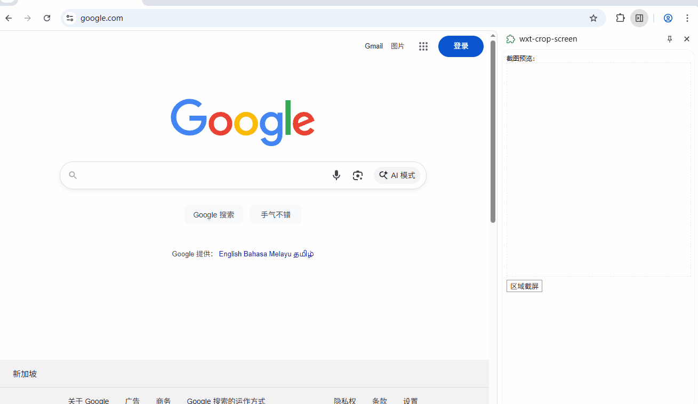
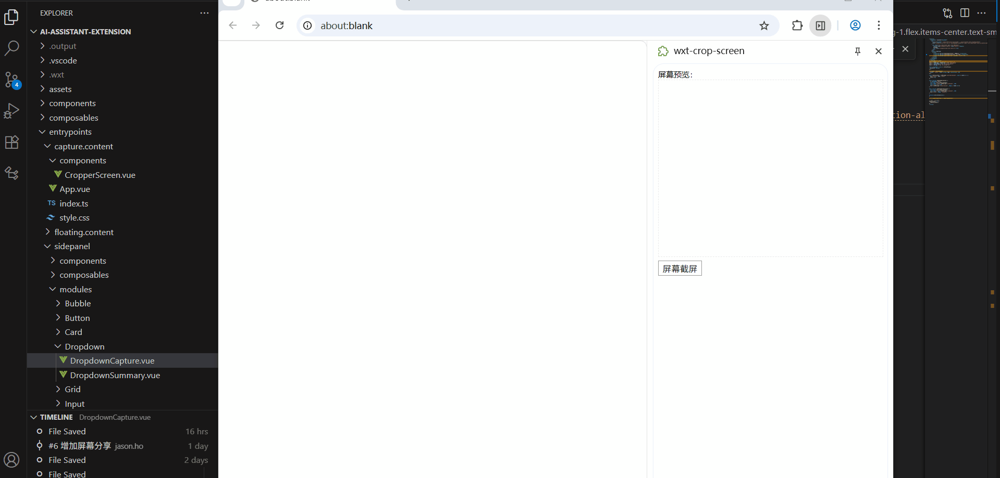

# 网页截图浏览器插件

一个基于 WXT 框架和 Vue 3 开发的浏览器截图插件，支持区域截图和屏幕截图两种模式。


## 功能特性

- **区域截图** - 使用 Cropper.js(v1版本) 精确选择网页任意区域
- **屏幕截图** - 基于 `getDisplayMedia` API 捕获整个屏幕内容

## 预览效果

1. 区域截图
   

2. 屏幕截图
   

## 安装方法

1. 安装依赖：

```bash
pnpm install
```

2. 启动项目:

```bash
pnpm dev
```

启动后会自动打开浏览器（默认为谷歌浏览器）

## 许可证

本项目采用 MIT 许可证 - 查看 [LICENSE](LICENSE) 文件了解详情

## 支持

如果您在使用过程中遇到任何问题，请通过以下方式联系：

- 提交 [Issue](https://github.com/hopkinson/wxt-crop-screen/issues)

## 致谢

- [WXT](https://wxt.dev/) - 优秀的浏览器扩展开发框架
- [Vue.js](https://vuejs.org/) - 渐进式 JavaScript 框架
- [Cropper.js](https://fengyuanchen.github.io/cropperjs/v1/) - 强大的图片裁剪库
